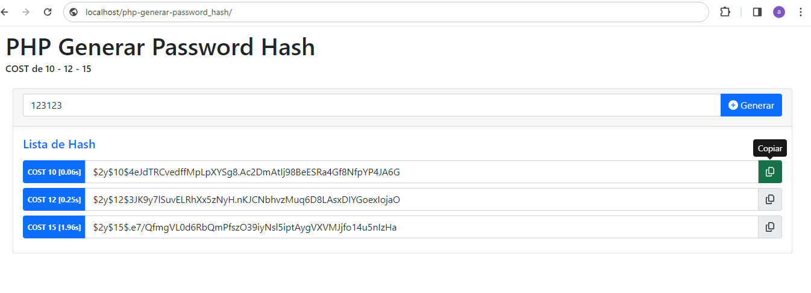
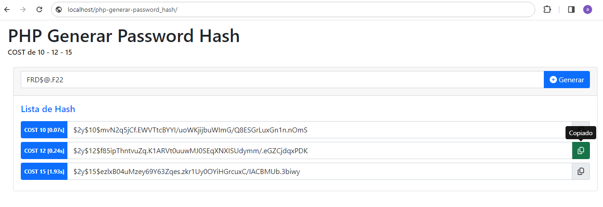

# php-generar-password_hash
PHP 7, PHP 8 donde ingresas un texto y genera un Password Hash utilizando el algoritmo `PASSWORD_DEFAULT`
[https://www.php.net/manual/es/function.password-hash.php]

La función `password_hash()` es una envoltura simple de la función `crypt()` y es compatible con los hash de contraseñas generados con crypt.
La función `password_hash()` utiliza un hash fuerte, genera y utiliza automáticamente un `salt` fuerte.
[https://www.php.net/manual/es/function.crypt.php]

El valor por defecto de cost en password_hash() es 10. 
Aumentar el cost mejora el hash resultante, pero requiere más procesamiento.
En el archivo `password_hash.php` se pueden configurar el cost en la siguiente opción:
```

['cost' => 12,]

```
OBS: Se puede modificar el formulario para agregar un select de Algoritmo o un input para ingresar el Cost.

## Librerias
- [ ] jquery-3.7.1. [https://jquery.com/download/]
- [ ] Bootstrap 5.1 [https://getbootstrap.com/docs/5.1/getting-started/download/]
- [ ] sweetalert2 [https://sweetalert2.github.io/#download]
- [ ] Font Awesome Free 6.5.1 [https://fontawesome.com/download]


## Clonar Repositorio
```
git clone https://github.com/compuvalpo/php-generar-password_hash.git
```


## Lavantar Repositorio en local
Una vez clonado el repositorio en su carpeta de Apache [www - htdocs - html - u otra según su versión] debe acceder a la siguiente url
`http://localhost/php-generar-password_hash`


## Comparar Hashed
Para comparar si 2 Hash son iguales, se debe utilizar la función `password_verify` [https://www.php.net/manual/es/function.password-verify.php]
```
$passUsuario = '1';
if (password_verify($passUsuario, '$2y$10$9ouuxu2Pd8aU6GTEKZ8lCu2BUcORTjgMJ.0lJ45LZpsXozFvlDA7G')) {
	echo 'La contraseña es válida!';
} else {
	echo 'La contraseña no es válida.';
}
```

## Capturas

